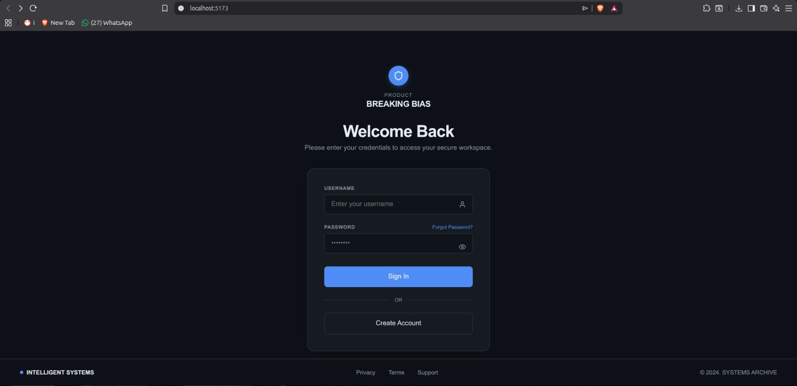
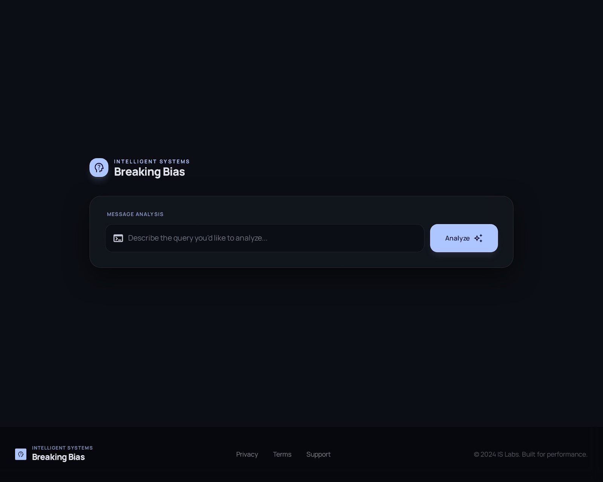
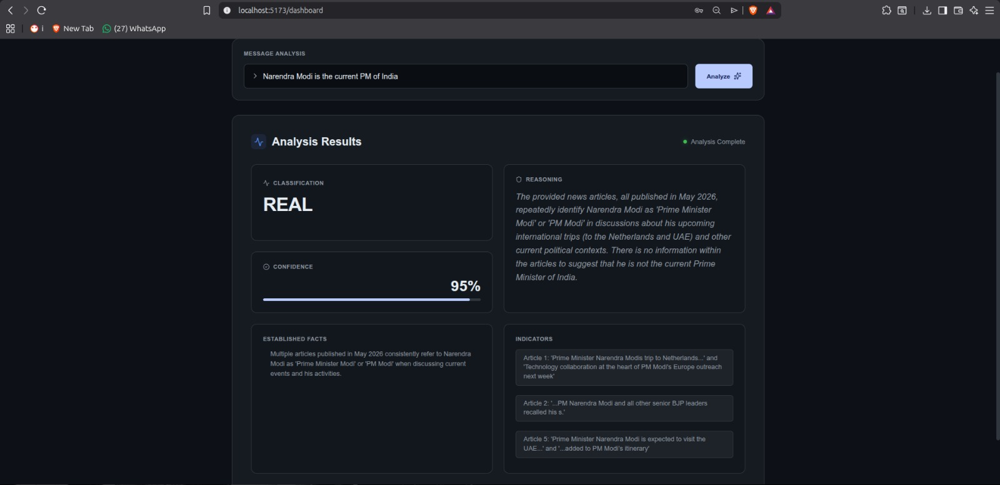

# 🔍 Breaking Bias — AI-Powered News Fact-Checker

<div align="center">


[](https://react.dev/)
[](https://spring.io/projects/spring-boot)
[](https://www.postgresql.org/)
[](https://ai.google.dev/)
[](https://vercel.com/)
[](https://railway.app/)

**Breaking Bias** is a full-stack AI-powered news fact-checking web application that allows users to submit any news claim and instantly receive a structured verdict on its credibility — backed by real-time news data and Google Gemini AI.

[🌐 Live Demo](https://breaking-bias-frontend.vercel.app) · [🐛 Report Bug](https://github.com/Vivek-dev-04/Breaking-Bias/issues) · [💡 Request Feature](https://github.com/Vivek-dev-04/Breaking-Bias/issues)

</div>

---

## 📸 Screenshots

<<<<<<< HEAD
| Login Page | Dashboard | Analysis Result |
|---|---|---|
|  |  |  |
=======
## 📸 Screenshots

| Login Page | Dashboard | Analysis Result |
|---|---|---|
|  |  |  |
>>>>>>> 661c322c43e954a55f9cb5c3b1047c965d3e7563

---

## 📋 Table of Contents

- [About The Project](#-about-the-project)
- [Features](#-features)
- [Tech Stack](#-tech-stack)
- [Project Structure](#-project-structure)
- [Getting Started](#-getting-started)
  - [Prerequisites](#prerequisites)
  - [Installation](#installation)
  - [Environment Variables](#environment-variables)
  - [Running Locally](#running-locally)
- [API Endpoints](#-api-endpoints)
- [Architecture](#-architecture)
- [Deployment](#-deployment)
- [Team](#-team)
- [License](#-license)

---

## 🧠 About The Project

In today's digital age, misinformation spreads faster than truth. **Breaking Bias** was built to combat this by providing an automated, real-time, AI-powered fact-checking solution accessible to everyone.

Unlike general-purpose AI assistants like ChatGPT or Claude, Breaking Bias is a **purpose-built system** that:

- Fetches **live news articles** via News API for real-time context
- Uses **domain-specific prompt engineering** for strict fact verification
- Returns **structured, machine-readable JSON verdicts** every time
- Provides a **dedicated UI** designed for non-technical users
- Features **secure user authentication** with email verification
- Is **fully deployable** as an independent web application

---

## ✨ Features

### 🔐 Authentication
- ✅ Three-step email-verified registration flow
- ✅ Spring Security form-based login
- ✅ Session-based authentication with JSESSIONID cookie
- ✅ Password reset via tokenized email link
- ✅ BCrypt password hashing (cost factor 12)

### 🔍 News Analysis
- ✅ Submit any news claim, headline, or article text
- ✅ AI-powered keyword extraction from claims
- ✅ Real-time news retrieval via News API
- ✅ Google Gemini Flash 2.0 analysis with structured output
- ✅ Fallback to general knowledge when no articles found

### 📊 Analysis Output
- ✅ Classification: `REAL` | `FAKE` | `MISLEADING` | `PARTIALLY_TRUE` | `UNCERTAIN`
- ✅ Confidence score (0–100%)
- ✅ Established facts list
- ✅ Detailed reasoning explanation
- ✅ Red flag indicators

### 📧 Email Integration
- ✅ Brevo API for reliable transactional emails
- ✅ Registration verification emails
- ✅ Password reset emails

---

## 🛠 Tech Stack

### Frontend
| Technology | Version | Purpose |
|---|---|---|
| React.js | 18.x | Component-based UI |
| Vite | 5.x | Build tool |
| Tailwind CSS | 3.x | Utility-first styling |
| React Router DOM | 6.x | Client-side routing |
| Axios | 1.x | HTTP client |

### Backend
| Technology | Version | Purpose |
|---|---|---|
| Spring Boot | 3.x | REST API framework |
| Spring Security | 6.x | Authentication & authorization |
| Spring Data JPA | 3.x | ORM & database access |
| Spring AI | 1.x | Google Gemini integration |
| Hibernate | 6.x | Database ORM |

### External Services
| Service | Purpose |
|---|---|
| Google Gemini Flash 2.0 | AI news analysis |
| News API v2 | Real-time news retrieval |
| Brevo API | Transactional email delivery |
| Supabase PostgreSQL | Cloud database |

### Deployment
| Platform | Purpose |
|---|---|
| Vercel | Frontend hosting |
| Railway | Backend hosting |
| Supabase | PostgreSQL database |

---

## 📁 Project Structure

```
Breaking-Bias/
├── Frontend/                          # React.js application
│   ├── public/
│   ├── src/
│   │   ├── pages/
│   │   │   ├── Login.jsx              # Login page
│   │   │   ├── EmailRegistration.jsx  # Step 1: Email submission
│   │   │   ├── FullRegistration.jsx   # Step 3: Complete profile
│   │   │   ├── Dashboard.jsx          # Main analysis page
│   │   │   ├── ForgotPassword.jsx     # Password reset request
│   │   │   └── ResetPassword.jsx      # New password form
│   │   ├── layouts/
│   │   │   └── AuthLayout.jsx         # Shared auth layout
│   │   ├── services/
│   │   │   └── axiosConfig.js         # Axios base config
│   │   ├── App.jsx                    # Router setup
│   │   └── main.jsx                   # Entry point
│   ├── vercel.json                    # Vercel routing config
│   ├── package.json
│   └── vite.config.js
│
├── Backend/                           # Spring Boot application
│   ├── src/main/java/com/project/Breakiing_Bias/
│   │   ├── Controller/
│   │   │   ├── UserController.java    # Auth endpoints
│   │   │   └── ChatController.java    # Analysis endpoint
│   │   ├── Service/
│   │   │   ├── UserService.java       # User business logic
│   │   │   ├── ChatService.java       # AI orchestration
│   │   │   ├── NewsService.java       # News API integration
│   │   │   ├── emailService.java      # Email via Brevo
│   │   │   ├── ClaimProcessingService.java  # Keyword extraction
│   │   │   └── MyUserDetailsService.java    # Spring Security
│   │   ├── Entity/
│   │   │   └── Users.java             # User entity
│   │   ├── Repository/
│   │   │   └── UserRepo.java          # JPA repository
│   │   ├── DTO/
│   │   │   ├── ChatRequest.java
│   │   │   ├── ChatResponse.java
│   │   │   ├── EmailRequest.java
│   │   │   ├── UsernameRequest.java
│   │   │   ├── ResetPasswordRequest.java
│   │   │   ├── NewsResponse.java
│   │   │   └── Article.java
│   │   └── config/
│   │       ├── SecurityConfig.java    # Spring Security config
│   │       └── JwtFilter.java         # JWT filter
│   ├── src/main/resources/
│   │   └── application.properties    # App configuration
│   ├── Dockerfile                     # Docker config for Railway
│   ├── pom.xml                        # Maven dependencies
│   └── system.properties             # Java version config
│
└── README.md
```

---

## 🚀 Getting Started

### Prerequisites

Make sure you have the following installed:

```bash
# Java 21
java -version

# Maven 3.9+
mvn -version

# Node.js 18+
node -version

# npm 9+
npm -version
```

You also need accounts for:
- [Google AI Studio](https://aistudio.google.com/) — for Gemini API key
- [News API](https://newsapi.org/) — for news data
- [Brevo](https://brevo.com/) — for email delivery
- [Supabase](https://supabase.com/) — for PostgreSQL database

---

### Installation

**1. Clone the repository:**
```bash
git clone https://github.com/Vivek-dev-04/Breaking-Bias.git
cd Breaking-Bias
```

**2. Install Frontend dependencies:**
```bash
cd Frontend
npm install
```

**3. Install Backend dependencies:**
```bash
cd ../Backend
mvn clean install -DskipTests
```

---

### Environment Variables

**Frontend — create `Frontend/.env`:**
```env
VITE_API_BASE_URL=http://localhost:8080
```

**Backend — update `Backend/src/main/resources/application.properties`:**
```properties
spring.application.name=Breaking_Bias

# Database (PostgreSQL)
spring.datasource.url=jdbc:postgresql://localhost:5432/breakingbias
spring.datasource.username=postgres
spring.datasource.password=yourpassword
spring.datasource.driver-class-name=org.postgresql.Driver
spring.jpa.hibernate.ddl-auto=update
spring.jpa.show-sql=true
spring.jpa.database-platform=org.hibernate.dialect.PostgreSQLDialect

# Google Gemini AI
spring.ai.google.genai.api-key=your_gemini_api_key
spring.ai.google.genai.chat.options.model=gemini-2.5-flash

# Brevo Email API
brevo.api.key=your_brevo_api_key

# Server
server.port=8080

# App URLs
app.base-url=http://localhost:8080
app.frontend-url=http://localhost:5173

# Session Cookie
server.servlet.session.cookie.http-only=true
server.servlet.session.cookie.secure=false
server.servlet.session.cookie.same-site=lax
```

---

### Running Locally

**1. Start the Backend:**
```bash
cd Backend
mvn spring-boot:run
```
Backend will start at `http://localhost:8080`

**2. Start the Frontend:**
```bash
cd Frontend
npm run dev
```
Frontend will start at `http://localhost:5173`

**3. Open your browser:**
```
http://localhost:5173
```

---

## 📡 API Endpoints

### Authentication Endpoints (Public)

| Method | Endpoint | Description | Request Body |
|---|---|---|---|
| `POST` | `/api/auth/start` | Send verification email | `{ "email": "..." }` |
| `GET` | `/api/auth/verify` | Verify email token | `?token=UUID` |
| `POST` | `/api/auth/complete` | Complete registration | `{ email, username, password }` |
| `POST` | `/api/auth/login` | Login | `username=...&password=...` (form) |
| `POST` | `/api/auth/forgot/start` | Send password reset email | `{ "username": "..." }` |
| `GET` | `/api/auth/forgot/verify` | Verify reset token | `?token=UUID` |
| `POST` | `/api/auth/forgot/complete` | Reset password | `{ token, newPassword }` |

### Analysis Endpoint (Authenticated)

| Method | Endpoint | Description | Request Body |
|---|---|---|---|
| `POST` | `/api/analyze` | Analyze news claim | `{ "request": "claim text" }` |

### Sample Response

```json
{
  "classification": "FAKE",
  "confidence": 92,
  "facts": [
    "MK Stalin is the current Chief Minister of Tamil Nadu",
    "C Joseph Vijay is an actor, not a politician",
    "No credible source reports Vijay as CM"
  ],
  "reason": "The claim that C Joseph Vijay is the current CM of Tamil Nadu is false. MK Stalin of the DMK party has been the Chief Minister since May 2021 and continues to hold the position.",
  "indicators": [
    "No official government source confirms this claim",
    "Vijay has no political appointment record",
    "Multiple news sources identify MK Stalin as current CM"
  ]
}
```

---

## 🏗 Architecture

```
┌─────────────────────────────────────────────────────────────┐
│                    React.js Frontend                         │
│              (Vercel · localhost:5173)                       │
│  Login │ Register │ Dashboard │ ForgotPassword │ Reset      │
└──────────────────────┬──────────────────────────────────────┘
                       │ HTTP (Axios · withCredentials)
                       ▼
┌─────────────────────────────────────────────────────────────┐
│                 Spring Security Filter                       │
│         CORS · CSRF disabled · Session management           │
│              /api/auth/** → permitAll                        │
│              /api/analyze → authenticated                    │
└──────────────────────┬──────────────────────────────────────┘
                       │
                       ▼
┌─────────────────────────────────────────────────────────────┐
│              Spring Boot Backend                             │
│           (Railway · localhost:8080)                         │
│                                                              │
│  UserController          ChatController                      │
│       │                       │                             │
│  UserService            ChatService                          │
│       │                  │         │                        │
│  UserRepo          NewsService  ClaimProcessingService       │
│       │                  │                                  │
│  PostgreSQL         News API    Google Gemini Flash 2.0     │
│  (Supabase)                                                  │
│                                                              │
│  emailService → Brevo API                                    │
└─────────────────────────────────────────────────────────────┘
```

---

## 🌍 Deployment

The application is deployed across three platforms:

| Component | Platform | URL |
|---|---|---|
| Frontend | Vercel | https://breaking-bias-frontend.vercel.app |
| Backend | Railway | https://breaking-bias-production.up.railway.app |
| Database | Supabase | PostgreSQL on AWS ap-northeast-1 |

### Deploy Your Own

**Frontend (Vercel):**
1. Push code to GitHub
2. Import repo on [vercel.com](https://vercel.com)
3. Set Root Directory: `Frontend`
4. Add env variable: `VITE_API_BASE_URL=your_backend_url`
5. Deploy

**Backend (Railway):**
1. Push code to GitHub
2. New project on [railway.app](https://railway.app)
3. Set Root Directory: `Backend`
4. Add all environment variables (see table below)
5. Deploy

**Railway Environment Variables:**

| Key | Description |
|---|---|
| `DB_URL` | `jdbc:postgresql://host:5432/dbname` |
| `DB_USER` | Database username |
| `DB_PASSWORD` | Database password |
| `KEY` | Google Gemini API key |
| `BREVO_API_KEY` | Brevo transactional email API key |
| `MAIL_ADDRESS` | Verified sender email in Brevo |
| `BACKEND_URL` | Railway backend URL |
| `FRONTEND_URL` | Vercel frontend URL |
| `PORT` | `8080` |

---

## 👨‍💻 Team

This project was developed as a Minor Project at **JECRC University, Jaipur** (Session 2024–25).

| Name | Roll No | Role |
|---|---|---|
| **Vivek Tikkiwal** | 23BCON0458 | Backend Development — Spring Boot, Spring Security, AI Integration, APIs |
| **Brajraj Singh Chundawat** | 23BCON1958 | Frontend Development — React.js, UI/UX Design, Tailwind CSS |
| **Kanika Rathore** | 23BCON0425 | Documentation, Presentation, Project Report |

---

## 🤔 FAQ

**Q: How is this different from ChatGPT or Claude?**

A: Breaking Bias is a purpose-built fact-checking system, not a general AI chat. It fetches live news articles in real-time, uses domain-specific strict verification prompts, returns structured JSON verdicts every time, and provides a dedicated UI. The AI is just one component — the entire pipeline is the product.

**Q: Why does analysis take 8–15 seconds?**

A: The delay is from fetching live news articles + Gemini AI inference time. Future versions will implement caching for frequently checked claims.

**Q: Can I use this without creating an account?**

A: Currently no — authentication is required to access the analysis feature. This is by design to prevent abuse.

---

## 📄 License

This project is licensed under the MIT License — see the [LICENSE](LICENSE) file for details.

---

## 🙏 Acknowledgements

- [Google Gemini AI](https://ai.google.dev/) for the AI analysis engine
- [News API](https://newsapi.org/) for real-time news data
- [Brevo](https://brevo.com/) for reliable email delivery
- [Spring Boot](https://spring.io/) for the robust backend framework
- [React](https://react.dev/) for the frontend framework
- [Tailwind CSS](https://tailwindcss.com/) for the styling system
- [JECRC University](https://www.jecrcuniversity.edu.in/) for the academic support

---

<div align="center">
Made with ❤️ by Team Breaking Bias · JECRC University Jaipur · 2024-25
</div>
